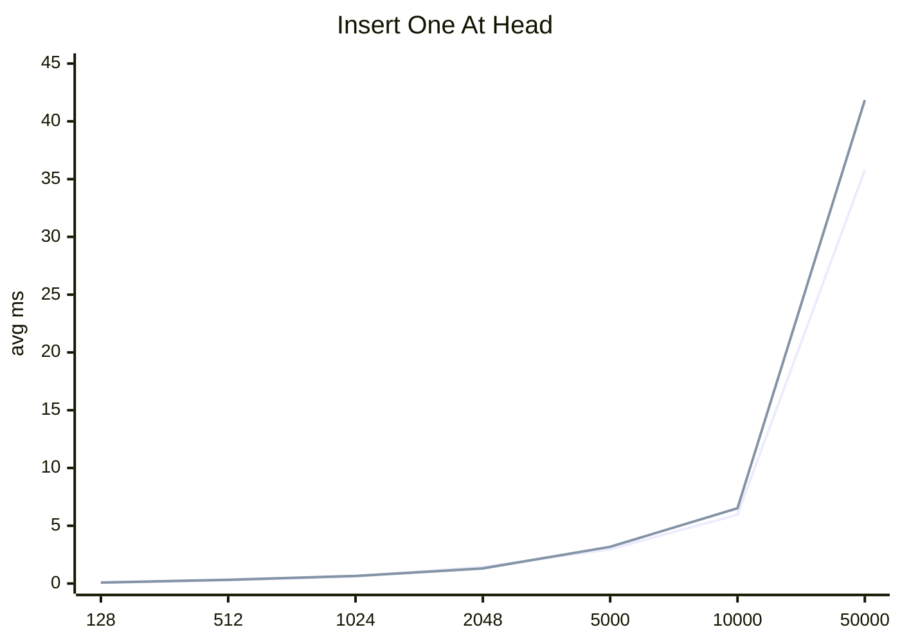
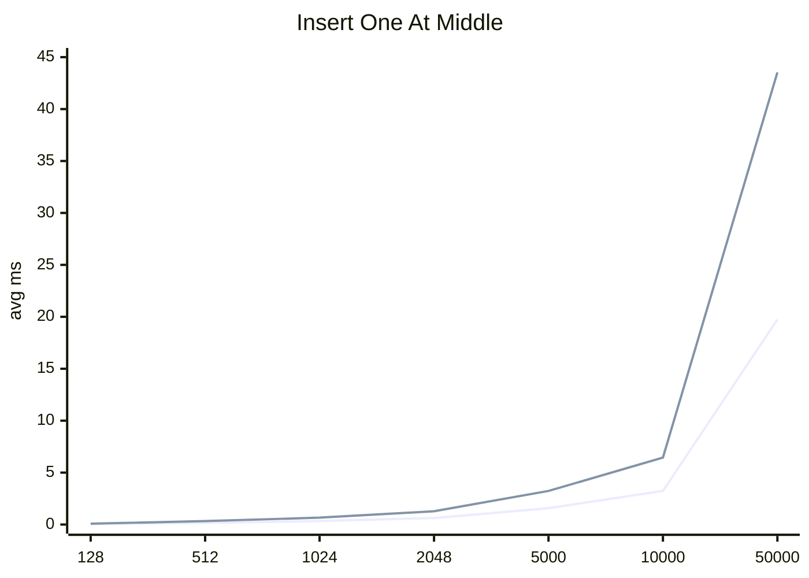
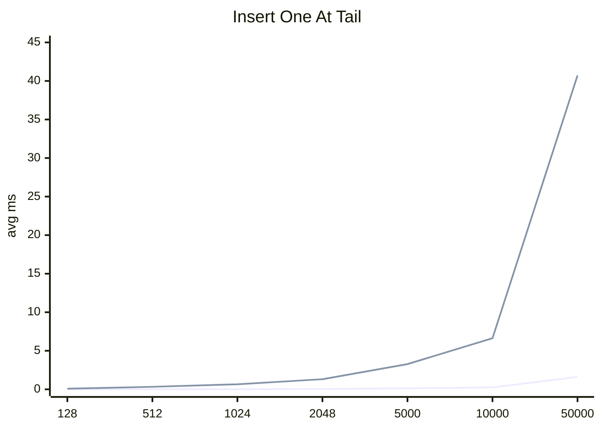
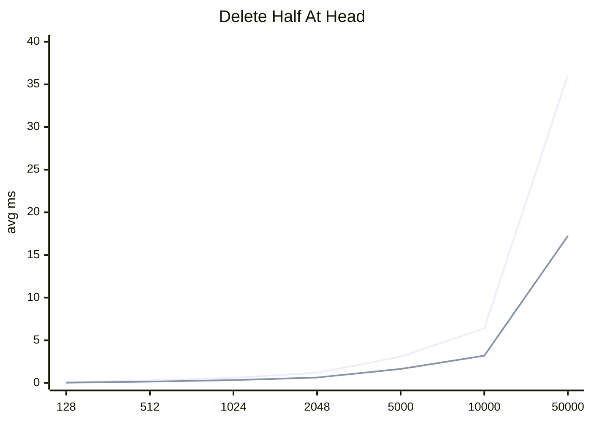
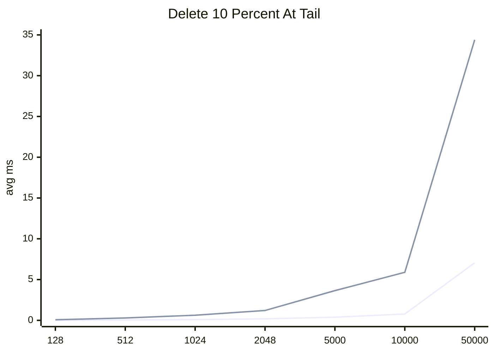

# Visible Lookup Maintenance Benchmark

## Purpose

This document explains the benchmark method and results for the visible model lookup table maintenance strategy in `MLListFlattenService`.

The manager maintains two lookup tables:

```objc
visibleIndexByKey // key -> visible index
visibleModelByKey // key -> visible model
```

When `visibleItems` changes through insertion, deletion, replacement, expansion, or collapse, there are two possible maintenance strategies:

1. Incremental maintenance: update only the affected keys and shift suffix indexes when needed.
2. Full rebuild: iterate over the new `visibleItems` and rebuild both lookup tables from scratch.

The benchmark validates whether the current strategy selection is reasonable:

```objc
NSUInteger changedCount = range.length + replacementItems.count;
NSUInteger indexShiftCount = delta == 0 ? 0 : suffixCount;
NSUInteger incrementalWork = indexShiftCount + changedCount * 2;
NSUInteger rebuildWork = visibleItems.count * 2;
BOOL shouldRebuildLookupTables = incrementalWork >= rebuildWork;
```

## Cost Model

`changedCount` represents the number of items directly removed or inserted by the mutation.

```text
Insert 1 item: range.length = 0, replacementItems.count = 1, changedCount = 1
Delete 1 item: range.length = 1, replacementItems.count = 0, changedCount = 1
Replace 1 item: range.length = 1, replacementItems.count = 1, changedCount = 2
Delete 5000 items: range.length = 5000, replacementItems.count = 0, changedCount = 5000
```

`indexShiftCount` represents the number of suffix indexes that must be shifted after an insertion or deletion. When the replacement has the same length as the original range, `delta == 0`, so suffix indexes do not change.

```text
Insert 1 item at head, visible = 50000: indexShiftCount = 50000
Insert 1 item at middle, visible = 50000: indexShiftCount = 25000
Insert 1 item at tail, visible = 50000: indexShiftCount = 0
```

Incremental maintenance cost:

```objc
incrementalWork = indexShiftCount + changedCount * 2;
```

`changedCount * 2` is used because adding or removing entries touches two lookup tables:

```objc
visibleIndexByKey
visibleModelByKey
```

`indexShiftCount` only affects `visibleIndexByKey`, because suffix models do not change; only their indexes change.

Full rebuild cost:

```objc
rebuildWork = visibleItems.count * 2;
```

A rebuild iterates over all new visible models and rebuilds both lookup tables.

## Method

Benchmark file:

```text
Tests/MLListFlattenServiceBenchmarkTests.m
```

Benchmark method:

```objc
-testVisibleLookupMaintenanceThresholdBenchmarks
```

Visible counts:

```text
128, 512, 1024, 2048, 5000, 10000, 50000
```

Each visible count covers 11 scenarios:

```text
replace_one_middle
insert_one_head
delete_one_head
insert_one_middle
delete_one_middle
insert_one_tail
delete_one_tail
delete_10_percent_head
delete_half_head
delete_10_percent_tail
delete_half_tail
```

Each scenario is sampled 10 times. The benchmark records:

```text
incremental_avg_ms
rebuild_avg_ms
```

It then compares the strategy chosen by the current heuristic with the actual faster strategy.

Reproduction command:

```sh
xcodebuild -quiet \
  -workspace KKMultiLevelList.xcworkspace \
  -scheme KKMultiLevelList \
  -destination 'platform=iOS Simulator,name=iPhone 15,OS=17.4' \
  -derivedDataPath /tmp/KKMultiLevelListWorkHeuristicScaleTests \
  CODE_SIGNING_ALLOWED=NO \
  -only-testing:KKMultiLevelListTests/MLListFlattenServiceBenchmarkTests/testVisibleLookupMaintenanceThresholdBenchmarks \
  test
```

Raw benchmark output:

```text
/tmp/kkmultilevel_lookup_threshold_benchmark.txt
```

## Overall Results

| visible count | cases | heuristic correct | wrong | meaningful wrong >= 1.2x |
| ---: | ---: | ---: | ---: | ---: |
| 128 | 11 | 10 | 1 | 0 |
| 512 | 11 | 9 | 2 | 0 |
| 1024 | 11 | 9 | 2 | 0 |
| 2048 | 11 | 8 | 3 | 0 |
| 5000 | 11 | 11 | 0 | 0 |
| 10000 | 11 | 10 | 1 | 0 |
| 50000 | 11 | 10 | 1 | 0 |

Summary:

```text
total cases = 77
heuristic correct = 67
meaningful wrong >= 1.2x = 0
```



```mermaid
xychart-beta
    title "Heuristic Accuracy By Visible Count"
    x-axis ["128", "512", "1024", "2048", "5000", "10000", "50000"]
    y-axis "correct cases" 0 --> 11
    bar "correct" [10, 9, 9, 8, 11, 10, 10]
    bar "wrong" [1, 2, 2, 3, 0, 1, 1]
```

## Insert 1 Item At Head

Inserting one item at the head shifts all suffix indexes, making it the heaviest single-item insertion scenario. The current strategy still selects incremental maintenance because incremental maintenance only updates `visibleIndexByKey`, while rebuild reconstructs both lookup tables.

| visible count | incremental avg ms | rebuild avg ms | heuristic | winner |
| ---: | ---: | ---: | --- | --- |
| 128 | 0.0787 | 0.0842 | incremental | incremental |
| 512 | 0.3049 | 0.3251 | incremental | incremental |
| 1024 | 0.6057 | 0.6533 | incremental | incremental |
| 2048 | 1.4422 | 1.3045 | incremental | rebuild |
| 5000 | 2.9609 | 3.1778 | incremental | incremental |
| 10000 | 5.9662 | 6.5189 | incremental | incremental |
| 50000 | 35.7822 | 41.8405 | incremental | incremental |



## Insert 1 Item At Middle

Middle insertion shifts only half of the suffix indexes, so incremental maintenance has a clearer advantage.

| visible count | incremental avg ms | rebuild avg ms | heuristic | winner |
| ---: | ---: | ---: | --- | --- |
| 128 | 0.0440 | 0.0847 | incremental | incremental |
| 512 | 0.1668 | 0.3323 | incremental | incremental |
| 1024 | 0.3320 | 0.6633 | incremental | incremental |
| 2048 | 0.6274 | 1.2798 | incremental | incremental |
| 5000 | 1.5699 | 3.2308 | incremental | incremental |
| 10000 | 3.2383 | 6.4504 | incremental | incremental |
| 50000 | 19.7359 | 43.5304 | incremental | incremental |



## Insert 1 Item At Tail

Tail insertion does not shift any suffix indexes. Incremental maintenance only adds entries to the two lookup tables, so it has the largest advantage.

| visible count | incremental avg ms | rebuild avg ms | heuristic | winner |
| ---: | ---: | ---: | --- | --- |
| 128 | 0.0032 | 0.0842 | incremental | incremental |
| 512 | 0.0113 | 0.3282 | incremental | incremental |
| 1024 | 0.0192 | 0.6579 | incremental | incremental |
| 2048 | 0.0498 | 1.3115 | incremental | incremental |
| 5000 | 0.1281 | 3.2713 | incremental | incremental |
| 10000 | 0.2452 | 6.6217 | incremental | incremental |
| 50000 | 1.6082 | 40.7121 | incremental | incremental |



## Delete 50% At Head

Deleting half of the list from the head requires incremental maintenance to remove many entries and shift all remaining suffix indexes. Rebuild only reconstructs the remaining half of the visible items, so rebuild is clearly faster.

| visible count | incremental avg ms | rebuild avg ms | heuristic | winner |
| ---: | ---: | ---: | --- | --- |
| 128 | 0.0863 | 0.0413 | rebuild | rebuild |
| 512 | 0.2950 | 0.1549 | rebuild | rebuild |
| 1024 | 0.6018 | 0.3378 | rebuild | rebuild |
| 2048 | 1.1955 | 0.6374 | rebuild | rebuild |
| 5000 | 3.0792 | 1.6439 | rebuild | rebuild |
| 10000 | 6.4012 | 3.1896 | rebuild | rebuild |
| 50000 | 36.1051 | 17.2454 | rebuild | rebuild |



## Delete 10% At Tail

Deleting 10% from the tail does not shift suffix indexes. It only removes the corresponding entries, so incremental maintenance is clearly faster.

| visible count | incremental avg ms | rebuild avg ms | heuristic | winner |
| ---: | ---: | ---: | --- | --- |
| 128 | 0.0108 | 0.0740 | incremental | incremental |
| 512 | 0.0404 | 0.2950 | incremental | incremental |
| 1024 | 0.0861 | 0.6266 | incremental | incremental |
| 2048 | 0.1880 | 1.2092 | incremental | incremental |
| 5000 | 0.3880 | 3.6467 | incremental | incremental |
| 10000 | 0.7752 | 5.8891 | incremental | incremental |
| 50000 | 7.0578 | 34.3973 | incremental | incremental |



## 50000 Visible Items Comparison

For 50000 visible items, the current strategy selects:

| operation | position | incremental avg ms | rebuild avg ms | heuristic | winner |
| --- | --- | ---: | ---: | --- | --- |
| insert_one | head | 35.7822 | 41.8405 | incremental | incremental |
| insert_one | middle | 19.7359 | 43.5304 | incremental | incremental |
| insert_one | tail | 1.6082 | 40.7121 | incremental | incremental |
| delete_half | head | 36.1051 | 17.2454 | rebuild | rebuild |
| delete_half | tail | 23.2826 | 19.3231 | rebuild | rebuild |
| delete_10_percent | head | 34.0338 | 30.4624 | incremental | rebuild |
| delete_10_percent | tail | 7.0578 | 34.3973 | incremental | incremental |

```mermaid
xychart-beta
    title "50000 Visible Items Key Scenarios"
    x-axis ["insert head", "insert middle", "insert tail", "delete half head", "delete half tail", "delete 10% head", "delete 10% tail"]
    y-axis "avg ms" 0 --> 45
    bar "incremental" [35.7822, 19.7359, 1.6082, 36.1051, 23.2826, 34.0338, 7.0578]
    bar "rebuild" [41.8405, 43.5304, 40.7121, 17.2454, 19.3231, 30.4624, 34.3973]
```



## Conclusions

1. Small insertions or deletions should usually use incremental maintenance, even when they happen at the head or middle.
2. Tail insertion and tail deletion are naturally good fits for incremental maintenance because no suffix indexes need to be shifted.
3. Large deletions, especially deleting 50% from the head, are better handled by full rebuild.
4. `incrementalWork >= rebuildWork` is easier to explain than a fixed threshold because it directly maps to the number of lookup-table entries each strategy needs to maintain.
5. In these 77 benchmark cases, there was no meaningful misprediction above 1.2x. The few mismatches are concentrated around boundary scenarios where both strategies have very similar runtimes.

## Notes

This benchmark measures lookup table maintenance only. It does not include IGListKit diffing or UI refresh cost. It is useful for deciding whether `MLListFlattenService` should use incremental lookup maintenance or full lookup rebuild, but it does not represent total list refresh time.
